# Squid Proxy Filtering Lab

A small cybersecurity and networking lab built with **VirtualBox, Ubuntu Server, and Squid Proxy**.

The project demonstrates how a forward proxy can control and monitor web traffic from isolated client machines using **domain-based filtering and access control**.

The lab was created to understand how university/enterprise proxy networks can be structured and how proxy-based web filtering works in a controlled environment.

---

## 📌 Project Overview

In this lab, an Ubuntu Server VM acts as a **Squid forward proxy**.

Client/participant VMs are placed on an isolated VirtualBox network and are configured to access the Internet through the Squid proxy.

The proxy listens on:

```text
10.50.225.222:3128
```

Websites can then be allowed or blocked using Squid ACL rules.

### Main objectives

* Understand how forward proxies work
* Configure Squid on Ubuntu Server
* Create an isolated VirtualBox network
* Route client web traffic through Squid
* Block selected domains
* Monitor proxy traffic through Squid logs
* Understand proxy-based access control
* Build a foundation for a controlled CTF network environment

---

# 🏗️ Network Architecture

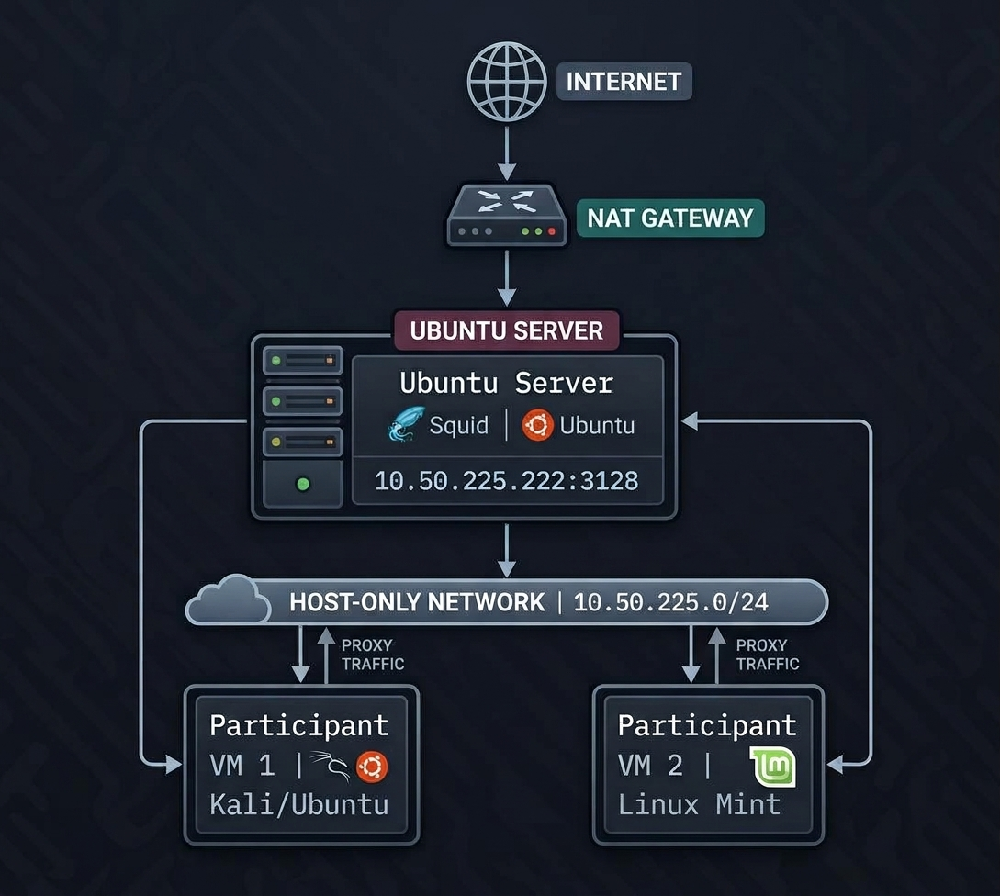


### Network interfaces

The proxy server uses two network interfaces:

| Interface | Purpose                       | Address            |
| --------- | ----------------------------- | ------------------ |
| `enp0s3`  | VirtualBox NAT / Internet     | DHCP               |
| `enp0s8`  | Host-only participant network | `10.50.225.222/24` |

Squid listens on:

```text
10.50.225.222:3128
```

---

# 🛠️ Technologies

* Ubuntu Server
* Squid Proxy
* VirtualBox
* Linux networking
* Squid ACL
* HTTP/HTTPS proxying
* Bash
* Git/GitHub

---

# ⚙️ Lab Setup

## 1. Create the VirtualBox network

Create a Host-only network:

```text
Network: 10.50.225.0/24
Host:    10.50.225.1
DHCP:    Disabled
```

Example:

```text
vboxnet0
```

---

## 2. Configure the Proxy VM

Create an Ubuntu Server VM with two network adapters.

### Adapter 1

```text
Attached to: NAT
```

This provides Internet access.

### Adapter 2

```text
Attached to: Host-only Adapter
Name: vboxnet0
```

Configure the second interface:

```text
IP Address: 10.50.225.222
Subnet:     255.255.255.0
```

---

# 📦 Installing Squid

Update Ubuntu:

```bash
sudo apt update
```

Install Squid:

```bash
sudo apt install squid -y
```

Check the service:

```bash
sudo systemctl status squid
```

---

# 🔧 Squid Configuration

The main configuration is located at:

```text
/etc/squid/squid.conf
```

Example configuration used in this project:

```conf
http_port 10.50.225.222:3128

acl lab_network src 10.50.225.0/24

acl blocked_domains dstdomain "/etc/squid/blocked_domains.txt"

http_access deny blocked_domains
http_access allow lab_network
http_access deny all
```

### Configuration explanation

```text
http_port
```

Defines the IP address and port where Squid accepts proxy connections.

```text
acl lab_network
```

Defines the participant network that is allowed to use the proxy.

```text
acl blocked_domains
```

Loads domains from the external blocklist.

```text
http_access deny blocked_domains
```

Blocks requests to domains contained in the blocklist.

```text
http_access allow lab_network
```

Allows clients from the lab network to use the proxy.

```text
http_access deny all
```

Denies everything else.

---

# 🚫 Domain Blocking

Blocked domains are stored in:

```text
config/blocked_domains.txt
```

Example:

```text
.facebook.com
.instagram.com
.twitter.com
.x.com
.tiktok.com
.reddit.com
.linkedin.com
.pinterest.com
.chatgpt.com
.openai.com
.claude.ai
.anthropic.com
.gemini.google.com
.perplexity.ai
.grok.com
.copilot.microsoft.com
.character.ai
.you.com
```

The leading `.` allows the rule to match the domain and its subdomains.

---

# 🧪 Testing

After modifying the Squid configuration, validate it:

```bash
sudo squid -k parse
```

Restart Squid:

```bash
sudo systemctl restart squid
```

Check its status:

```bash
sudo systemctl status squid
```

Verify that Squid is listening:

```bash
sudo ss -lntp | grep 3128
```

Expected:

```text
10.50.225.222:3128
```

---

# 🌐 Configure the Client

Configure the participant VM to use:

```text
Proxy IP: 10.50.225.222
Port:     3128
```

For example, Firefox can be configured using:

```text
Settings
→ Network Settings
→ Manual Proxy Configuration
```

---

# ✅ Allowed Website Test

A website that is not present in the blocklist should be accessible through the proxy.

Example:

```bash
curl -x http://10.50.225.222:3128 https://example.org
```

---

# ❌ Blocked Website Test

A domain present in the blocklist should be denied.

Example:

```bash
curl -I -x http://10.50.225.222:3128 https://www.reddit.com
```

Squid should reject the request.

---

# 📊 Monitoring Traffic

Squid stores access information in:

```text
/var/log/squid/access.log
```

Monitor requests in real time:

```bash
sudo tail -f /var/log/squid/access.log
```

This allows the administrator to observe requests passing through the proxy and whether they were allowed or denied.

---

# 📸 Screenshots

### VirtualBox Network

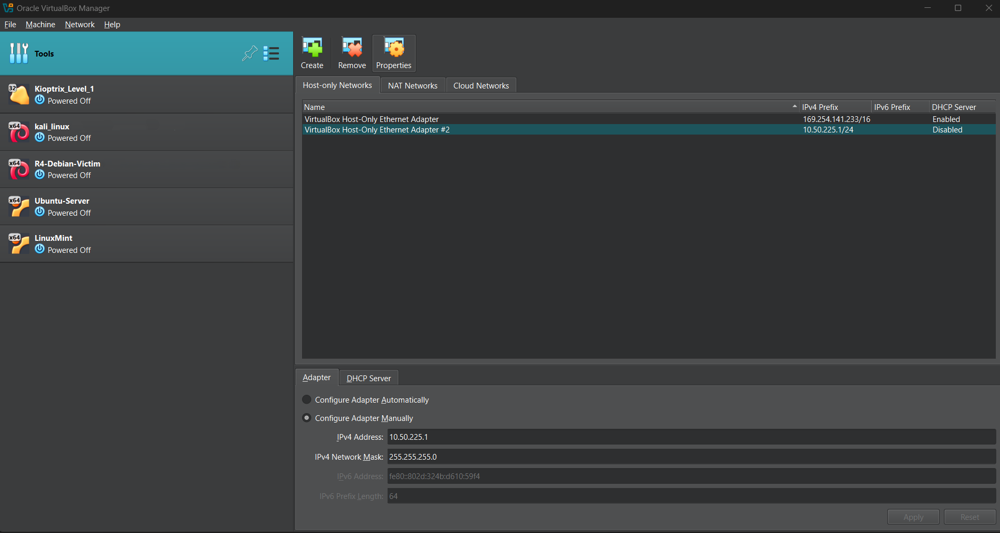

### Proxy IP Configuration

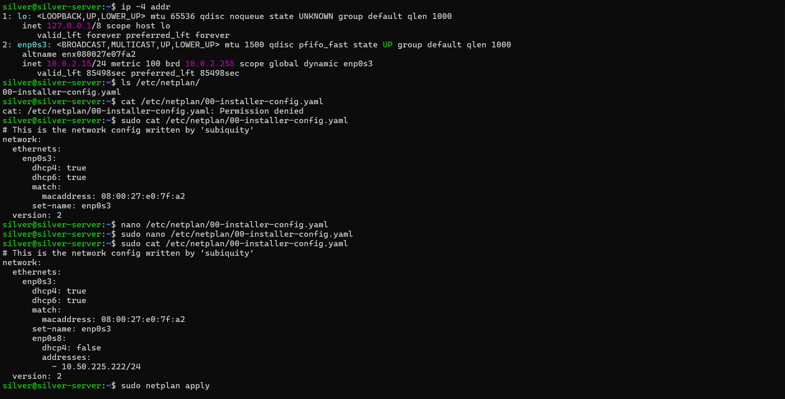

### Squid Running

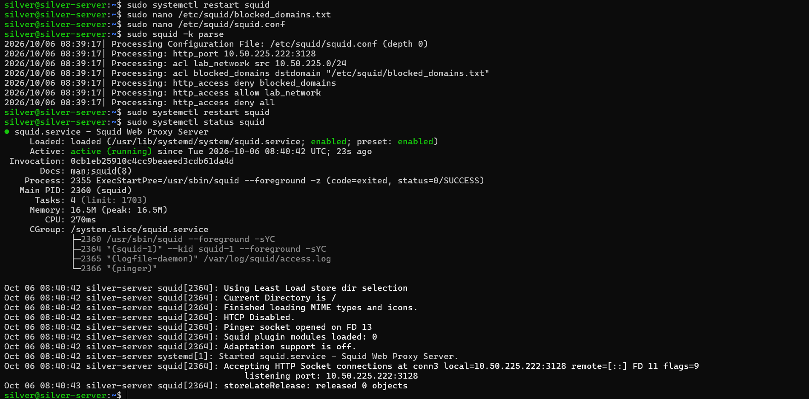

### Squid Configuration

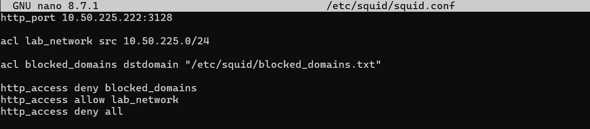

### Blocked Website

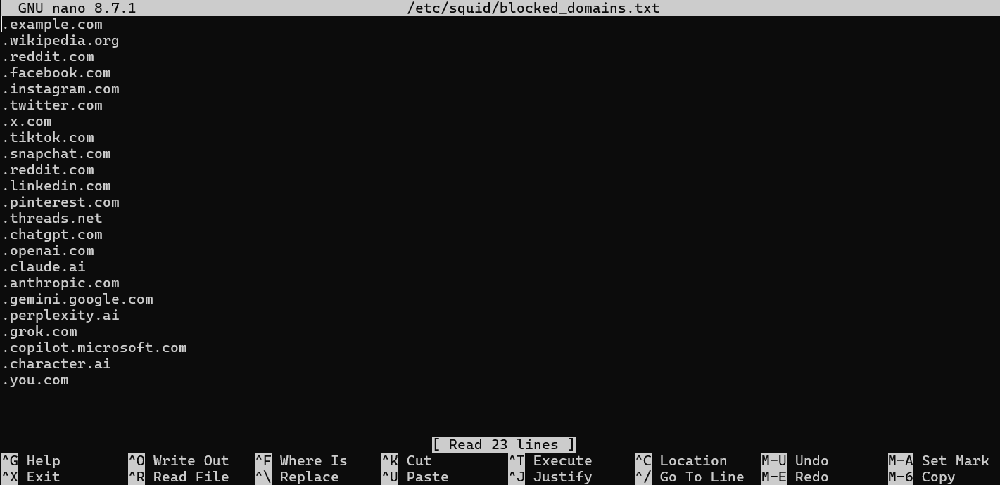
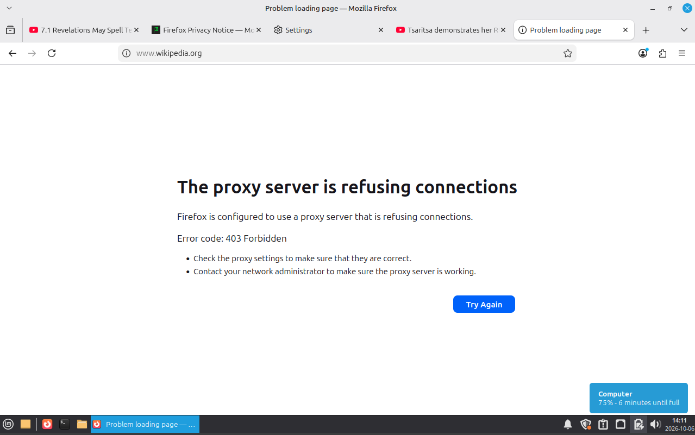
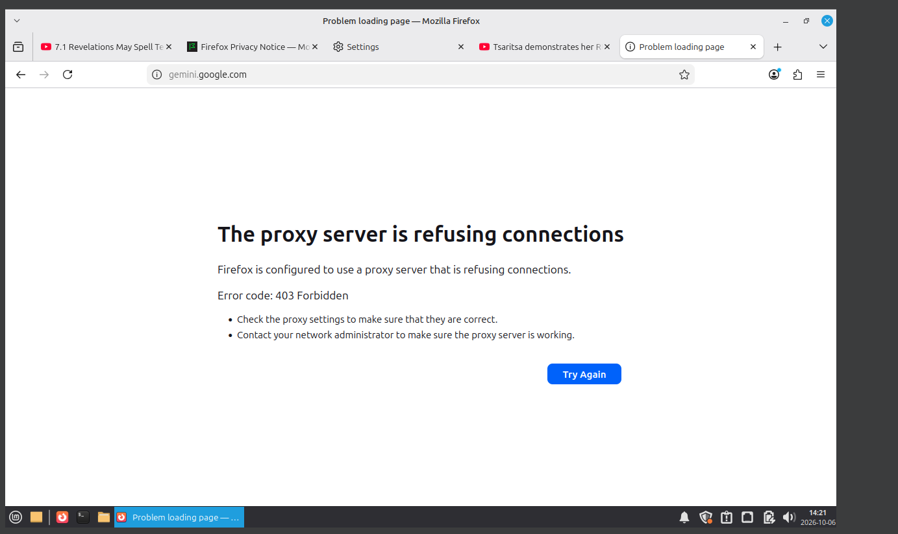
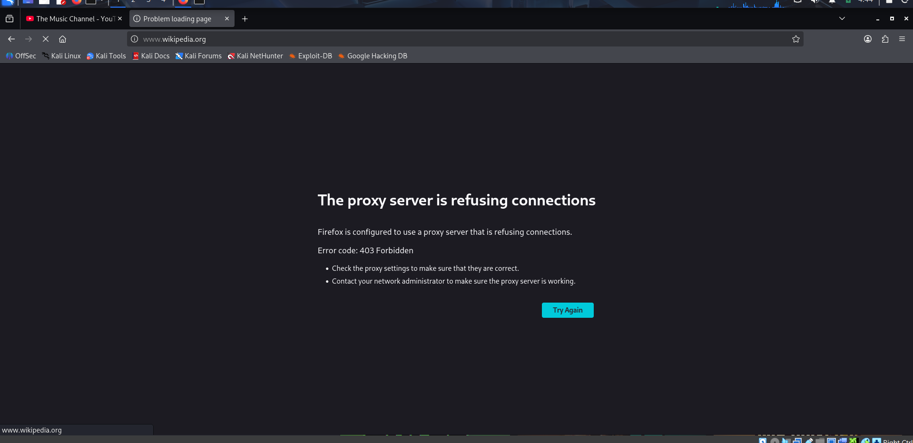
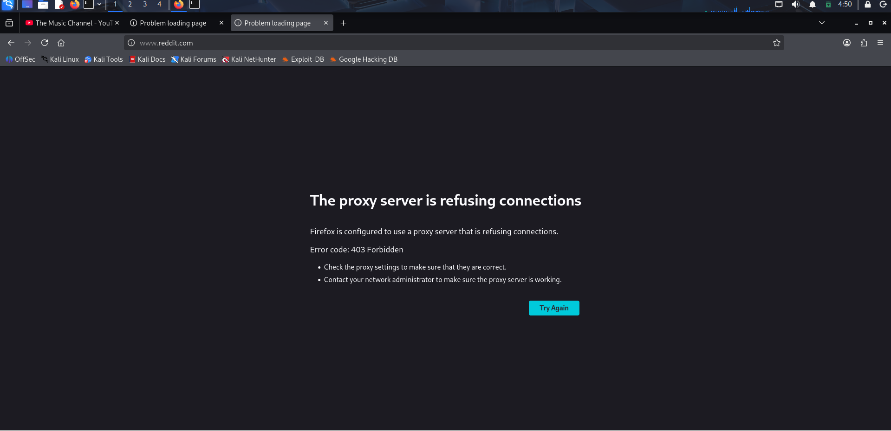
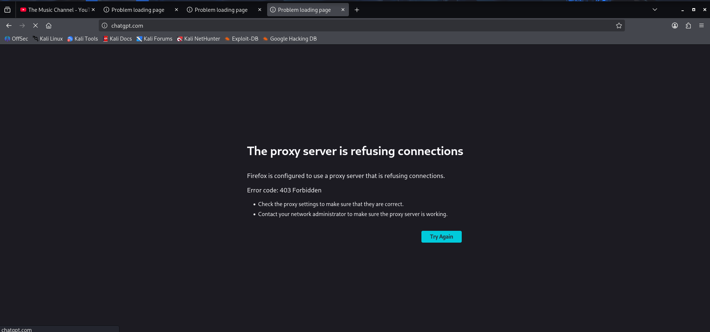
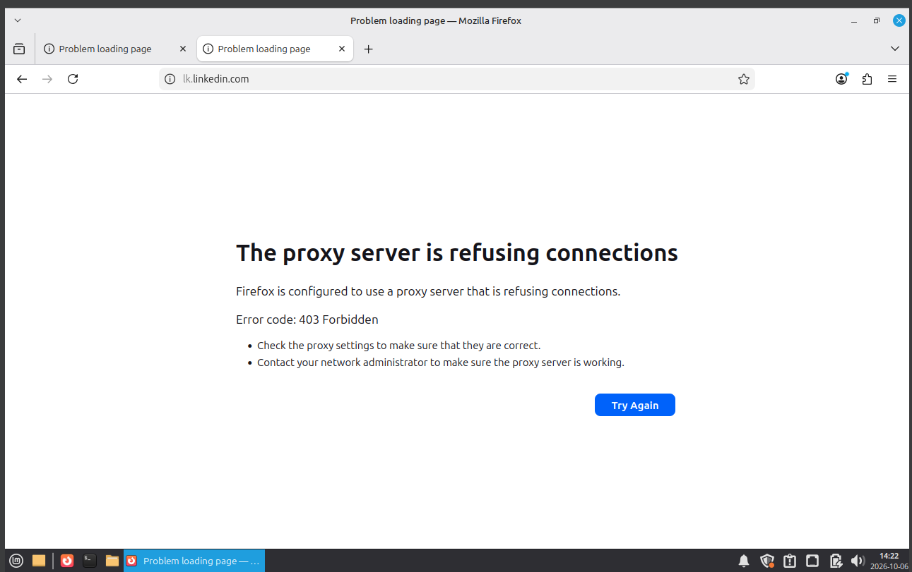


### Squid Access Log

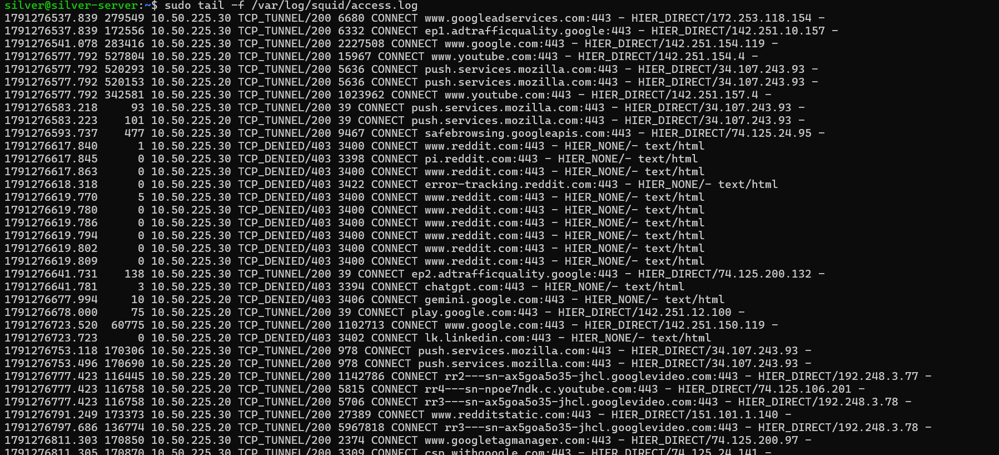

---

# 🔐 Security Concepts Demonstrated

This project demonstrates several fundamental networking and cybersecurity concepts:

* Forward proxy
* Network segmentation
* HTTP/HTTPS proxying
* Access Control Lists
* Domain-based filtering
* Traffic monitoring
* Centralized Internet access
* Network policy enforcement
* Virtualized security labs

---

# ⚠️ Limitations

This project demonstrates **basic proxy-level filtering** and is intentionally designed as a learning lab.

Domain blocking is not equivalent to complete Internet filtering.

Modern applications can use:

* Multiple domains
* Content Delivery Networks (CDNs)
* API endpoints
* Alternative domains
* Encrypted tunnels
* VPNs
* Other network paths

Therefore, a proxy-only solution should not be considered a complete method of preventing access to a particular category of service.

A production environment would typically combine proxy controls with firewalls, DNS filtering, network segmentation, endpoint policies, monitoring, and clearly defined usage policies.

---

# 🚀 Future Improvements

Possible future improvements include:

* [ ] Web-based proxy monitoring dashboard
* [ ] Category-based domain lists
* [ ] Allowlist mode
* [ ] Proxy authentication
* [ ] Centralized logging
* [ ] Firewall integration
* [ ] DNS filtering
* [ ] Multiple participant VLANs
* [ ] CTF-specific network segmentation
* [ ] Automated blocklist updates
* [ ] Grafana/Prometheus monitoring
* [ ] Dockerized deployment
* [ ] Automated lab deployment

---

# 🎯 Why I Built This

This project was created as a practical experiment to understand how proxy infrastructure works in university and enterprise environments.

The lab also serves as a foundation for experimenting with **controlled network environments for cybersecurity competitions and CTF infrastructure**.

Rather than only studying proxy concepts theoretically, the project recreates the architecture using VirtualBox and demonstrates the complete request flow:

```text
Client
  ↓
VirtualBox Host-Only Network
  ↓
Squid Proxy
  ↓
Access Control
  ↓
Internet
```

---

# 📚 Learning Outcomes

After completing this lab, you should understand:

1. What a forward proxy is
2. How clients communicate through a proxy
3. How Squid handles HTTP/HTTPS requests
4. How Squid ACLs work
5. How domain filtering can be implemented
6. How proxy logs can be used for monitoring
7. How virtual networks can simulate enterprise infrastructure
8. Why proxy filtering alone has limitations

---

# 📜 License

This project is intended for educational and authorized security testing purposes.

See the `LICENSE` file for details.
